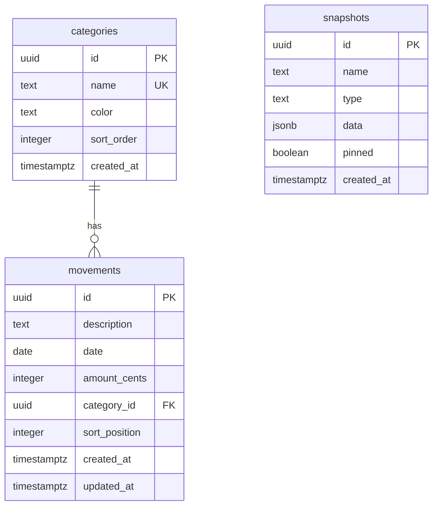

# feat: Financial Movements Tracker

## Overview

Replace Google Sheets-based financial movement tracking with an in-app feature in cajita. A single, continuous chronological list of all financial movements (income/expenses) with a running total, inline editing, real-time sync between 2 users, and snapshot-based backup/recovery.

## Problem Statement

The current Google Sheets workflow forces splitting movements by year due to sheet size limitations. The "Total" column (running cumulative balance) creates an architectural tension: storing it requires recalculation on every write, computing it requires loading all data. Additionally, Google Sheets lacks proper backup controls beyond its built-in version history.

## Proposed Solution

Build a movements tracker inside cajita using:

- **TanStack DB + ElectricSQL** for real-time sync and optimistic mutations
- **TanStack Virtual** for virtualized rendering of the full movement list
- **Frontend-computed running totals** (not stored in DB) — all movements loaded at once (~1MB at scale)
- **Snapshot system** for backup/recovery (auto daily + manual, with diff-based restore)
- **Inline editing** — click-to-edit cells, Tab/Enter navigation, Google Sheets-style UX

Key decisions carried forward from brainstorm (see brainstorm: `docs/brainstorms/2026-03-08-movements-tracker-brainstorm.md`):

| Decision | Choice |
|----------|--------|
| Running total | Computed client-side, not stored in DB |
| Data loading | All movements at once (trivial at this scale) |
| Rendering | Virtualized (TanStack Virtual) |
| Data layer | TanStack DB + Electric Collection (real-time sync) |
| Backup model | Auto daily snapshots (90-day retention) + manual (forever) + pinning |
| Restore UX | Full restore with diff preview |
| Same-date ordering | Insertion order + drag-and-drop (explicit `sort_position`) |
| Amount storage | Integer cents (4250 = $42.50) |
| Data ownership | Shared list between both users |
| Filtered running totals | Absolute balance (includes all movements before filter window) |

## Technical Approach

### Architecture

```
┌─────────────────────────────────────────────────┐
│                   Frontend                       │
│                                                  │
│  TanStack DB (Electric Collection)               │
│    └─ movementsCollection ←──── Electric Shapes  │
│    └─ categoriesCollection ←── Electric Shapes   │
│                                                  │
│  Live Queries (reactive, incremental)            │
│    └─ Filtered views, computed running totals    │
│                                                  │
│  TanStack Virtual (virtualized table rendering)  │
│    └─ Only ~40 rows in DOM at any time           │
│                                                  │
│  Mutations → HTTP to server functions             │
│    └─ Optimistic, auto-rollback on failure       │
└──────────┬───────────────────────┬───────────────┘
           │ mutations (HTTP)      │ sync (SSE)
           ▼                       ▼
┌──────────────────┐    ┌──────────────────┐
│   Nitro Server   │    │   ElectricSQL    │
│                  │    │    (Railway)      │
│  Server Functions│    │                  │
│  - CRUD movements│    │  Shape proxy     │
│  - Snapshots     │    │  endpoint in     │
│  - Categories    │    │  Nitro server    │
└────────┬─────────┘    └────────┬─────────┘
         │                       │
         ▼                       ▼
┌─────────────────────────────────────────┐
│          PostgreSQL (Railway)            │
│  wal_level = 'logical'                  │
│                                         │
│  Tables: movements, categories,         │
│          snapshots                       │
└─────────────────────────────────────────┘
```

### Database Schema

#### Migration: `002_movements.ts`

```sql
-- Categories table
CREATE TABLE categories (
  id UUID PRIMARY KEY DEFAULT gen_random_uuid(),
  name TEXT NOT NULL UNIQUE,
  color TEXT,
  sort_order INTEGER NOT NULL DEFAULT 0,
  created_at TIMESTAMPTZ NOT NULL DEFAULT now()
);

-- Movements table
CREATE TABLE movements (
  id UUID PRIMARY KEY DEFAULT gen_random_uuid(),
  description TEXT NOT NULL,
  date DATE NOT NULL,
  amount_cents INTEGER NOT NULL,
  category_id UUID REFERENCES categories(id) ON DELETE SET NULL,
  sort_position INTEGER NOT NULL DEFAULT 0,
  created_at TIMESTAMPTZ NOT NULL DEFAULT now(),
  updated_at TIMESTAMPTZ NOT NULL DEFAULT now()
);

CREATE INDEX idx_movements_date ON movements(date, sort_position);
CREATE INDEX idx_movements_category ON movements(category_id);

-- Snapshots table
CREATE TABLE snapshots (
  id UUID PRIMARY KEY DEFAULT gen_random_uuid(),
  name TEXT,
  type TEXT NOT NULL DEFAULT 'automatic' CHECK (type IN ('automatic', 'manual')),
  data JSONB NOT NULL,
  pinned BOOLEAN NOT NULL DEFAULT false,
  created_at TIMESTAMPTZ NOT NULL DEFAULT now()
);

CREATE INDEX idx_snapshots_type_created ON snapshots(type, created_at);
```

**Schema notes:**
- `amount_cents` is INTEGER — avoids floating-point precision issues. Display as dollars in the frontend (`amount_cents / 100`).
- `sort_position` uses integer with gaps of 1000 between entries. Rebalance when gaps exhaust (rare).
- `category_id` is nullable with `ON DELETE SET NULL` — movements survive category deletion.
- No `user_id` on movements — shared list between both users.
- `snapshots.data` is JSONB containing the full movements array at snapshot time.
- `updated_at` on movements enables conflict detection.

#### ERD



### ElectricSQL Infrastructure

**What's needed:**

1. **PostgreSQL WAL level** — Set `wal_level = 'logical'` on the Railway PostgreSQL instance:
   ```sql
   ALTER SYSTEM SET wal_level = 'logical';
   SELECT pg_reload_conf();
   ```

2. **ElectricSQL service** — Deploy on Railway using the [one-click template](https://railway.com/deploy/electricsql-1). Requires two env vars:
   - `DATABASE_URL` — same PostgreSQL connection string
   - `ELECTRIC_SECRET` — secret for client connections

3. **Shape proxy endpoint** — A server route in Nitro that forwards shape requests from the client to Electric, adding auth checks:
   ```
   src/server/routes/api/electric/[table].ts
   ```
   This proxy ensures only authenticated users can subscribe to shapes and controls which tables/columns are exposed.

### Frontend Data Layer (TanStack DB)

**Collections:**

```typescript
// src/lib/movements-collection.ts
import { createCollection } from '@tanstack/react-db'
import { electricCollectionOptions } from '@tanstack/electric-db-collection'

export const movementsCollection = createCollection(
  electricCollectionOptions({
    id: 'movements',
    shapeOptions: {
      url: '/api/electric/movements',
      params: { table: 'movements' }
    },
    getKey: (item) => item.id,
    schema: movementSchema,
    onInsert: async ({ transaction }) => { /* POST to server fn */ },
    onUpdate: async ({ transaction }) => { /* PUT to server fn */ },
    onDelete: async ({ transaction }) => { /* DELETE to server fn */ },
  })
)
```

**Live queries for running total:**

```typescript
// The live query returns all movements sorted by date + sort_position.
// Running total is computed as a derived value in the component
// using a simple reduce() over the query results.
const { data: movements } = useLiveQuery((q) =>
  q.from({ m: movementsCollection })
   .orderBy(({ m }) => m.date, 'asc')
   .orderBy(({ m }) => m.sort_position, 'asc')
)

// Compute running totals (< 1ms for 10K items)
const withTotals = useMemo(() => {
  let runningTotal = 0
  return movements.map(m => {
    runningTotal += m.amount_cents
    return { ...m, total_cents: runningTotal }
  })
}, [movements])
```

### New Dependencies

| Package | Purpose |
|---------|---------|
| `@tanstack/react-db` | TanStack DB core + React bindings |
| `@tanstack/electric-db-collection` | Electric sync adapter for TanStack DB |
| `@electric-sql/client` | Electric client SDK |
| `@tanstack/react-virtual` | Virtualized list rendering |

### File Structure

```
src/
├── db/
│   └── migrations/
│       └── 002_movements.ts          # New tables
├── server/
│   ├── movements.ts                   # CRUD server functions
│   ├── categories.ts                  # Category management
│   ├── snapshots.ts                   # Snapshot CRUD + restore
│   └── routes/
│       └── api/
│           └── electric/
│               └── [table].ts         # Electric shape proxy
├── lib/
│   ├── movements-collection.ts        # TanStack DB collection
│   ├── categories-collection.ts       # TanStack DB collection
│   └── format.ts                      # Amount formatting (cents → dollars)
├── components/
│   ├── MovementsTable.tsx             # Main virtualized table
│   ├── EditableCell.tsx               # Click-to-edit cell component
│   ├── CategorySelect.tsx             # Category dropdown
│   ├── DateRangeFilter.tsx            # Time-range filter
│   ├── CategoryFilter.tsx             # Category filter
│   ├── SnapshotPanel.tsx              # Snapshot list + actions
│   └── SnapshotDiff.tsx               # Diff preview before restore
└── routes/
    └── _authenticated/
        └── movements.tsx              # Movements page route
```

## Implementation Phases

### Phase 1: Foundation (DB + Infrastructure)

**Goal:** Database tables exist, ElectricSQL is deployed and syncing, basic server CRUD works.

**Tasks:**

- [ ] Create migration `002_movements.ts` with `categories`, `movements`, and `snapshots` tables
- [ ] Run migration locally and on Railway
- [ ] Enable `wal_level = 'logical'` on Railway PostgreSQL
- [ ] Deploy ElectricSQL service on Railway (one-click template)
- [ ] Create Electric shape proxy route at `src/server/routes/api/electric/[table].ts`
- [ ] Create `src/server/movements.ts` with CRUD server functions:
  - `getMovements` (GET) — all movements sorted by date + sort_position
  - `createMovement` (POST) — insert with Zod validation
  - `updateMovement` (POST) — update by ID with Zod validation
  - `deleteMovement` (POST) — delete by ID
- [ ] Create `src/server/categories.ts`:
  - `getCategories` (GET) — all categories sorted by sort_order
  - `createCategory` (POST)
- [ ] Seed initial categories (Free Income, Salary, Budget, Help, Taxes, Discretionary Expenses, Goodies, etc.)
- [ ] Verify Electric sync works end-to-end: insert via server function → appears via Electric shape

**Validation rules (server-side, Zod):**
- `description`: string, min 1 char, max 255 chars
- `amount_cents`: integer, non-zero
- `date`: valid date string (ISO format)
- `category_id`: optional UUID, must reference existing category
- `sort_position`: integer, defaults to `max(sort_position) + 1000` for the given date

### Phase 2: Core UI (Table + Inline Editing)

**Goal:** Movements page with a virtualized, inline-editable table showing running totals.

**Tasks:**

- [ ] Install dependencies: `@tanstack/react-db`, `@tanstack/electric-db-collection`, `@electric-sql/client`, `@tanstack/react-virtual`
- [ ] Create `src/lib/movements-collection.ts` — Electric collection with CRUD mutation handlers
- [ ] Create `src/lib/categories-collection.ts` — Electric collection (read-only for now)
- [ ] Create `src/lib/format.ts` — `formatCents(cents: number): string` (e.g., 4250 → "$42.50")
- [ ] Create `src/components/EditableCell.tsx`:
  - Click to enter edit mode (shows input)
  - Tab → next cell, Enter → confirm + move down, Escape → revert + exit
  - Type-specific inputs: text (description), date picker, number (amount), dropdown (category)
  - Optimistic: calls `movementsCollection.update()` on confirm
- [ ] Create `src/components/MovementsTable.tsx`:
  - Uses `@tanstack/react-virtual` for virtualized rows
  - Columns: Description, Date, Amount, Total, Category
  - Total column is computed client-side via `useMemo` reduce
  - Amount displays as formatted dollars (positive green, negative red)
  - "Add movement" button at bottom → inserts row with today's date, focuses Description cell
  - Delete button per row with confirmation dialog
- [ ] Create `src/routes/_authenticated/movements.tsx`:
  - Page route for `/movements`
  - Renders `MovementsTable`
  - Empty state when no movements exist ("No movements yet. Add your first one.")
- [ ] Add "Movements" to the nav bar in `src/routes/_authenticated.tsx`
- [ ] Create `src/components/CategorySelect.tsx`:
  - Dropdown populated from `categoriesCollection`
  - Used inside `EditableCell` for the category column

**Inline editing UX details:**
- Single-click on a cell → enter edit mode
- The cell shows an input matching the column type
- Tab: save current cell, move to next editable cell in the row
- Enter: save current cell, move to same column in next row
- Escape: revert to original value, exit edit mode
- Clicking outside: save and exit edit mode
- Amount input: user types number with optional minus sign. Stored as cents.
- New row: appended at the bottom with today's date pre-filled. `sort_position` = max + 1000 for that date.

### Phase 3: Filtering

**Goal:** Filter movements by time range (with correct running totals) and by category.

**Tasks:**

- [x] Create `src/components/DateRangeFilter.tsx`:
  - Presets: This Month, Last Month, This Year, Last Year, All Time, Custom Range
  - Custom range: two date pickers (start, end)
  - When active, the table shows only movements in the range BUT running totals include all prior movements (absolute balance)
- [x] Create `src/components/CategoryFilter.tsx`:
  - Dropdown of categories + "All Categories"
  - When a category is selected, Total column is hidden, only Amount is shown
- [x] Filters are mutually exclusive: selecting a category filter clears the date filter and vice versa
- [x] "Clear filter" button when any filter is active
- [x] Running total computation for time-range filter:
  ```typescript
  // All movements, sorted
  const allMovements = useLiveQuery(...)

  // Compute running totals for ALL movements first
  const allWithTotals = computeRunningTotals(allMovements)

  // Then filter to the visible range (totals are already correct)
  const visible = allWithTotals.filter(m => m.date >= from && m.date <= to)
  ```

### Phase 4: Snapshots & Recovery

**Goal:** Automatic daily snapshots, manual snapshots, diff-based restore.

**Tasks:**

- [x] Create `src/server/snapshots.ts`:
  - `getSnapshots` (GET) — list all snapshots, sorted by created_at desc
  - `createSnapshot` (POST) — create manual snapshot with optional name
  - `ensureTodaySnapshot` — create auto snapshot (called from page load check) + prune old ones
  - `pinSnapshot` (POST) — convert auto snapshot to pinned (permanent)
  - `deleteSnapshot` (POST) — only for unpinned auto snapshots
  - `getSnapshotData` (GET) — return full JSONB data for a specific snapshot
  - `restoreSnapshot` (POST) — transactional: create pre-restore backup snapshot, delete all movements, insert snapshot data
- [x] Auto snapshot trigger: on panel open, check if an auto snapshot exists for today. If not, create one. Also prune old snapshots.
- [x] Create `src/components/SnapshotPanel.tsx`:
  - Accessible from the movements page (slide-out panel)
  - Lists snapshots with: name/date, type badge (auto/manual/pinned), action buttons
  - "Create Snapshot" button with optional name input
  - "Pin" button on auto snapshots (converts to permanent)
  - "Restore" button → opens diff view
  - "Delete" button on unpinned auto snapshots only
- [x] Create `src/components/SnapshotDiff.tsx`:
  - Compares current movements against snapshot data
  - Summary: "X added, Y removed, Z modified since this snapshot"
  - Detailed diff showing individual row changes
  - "Confirm Restore" and "Cancel" buttons
  - On confirm: calls `restoreSnapshot`, which first creates a "Pre-restore backup" auto snapshot, then replaces all movements
- [x] Restore is transactional (single DB transaction):
  1. Insert pre-restore backup snapshot
  2. Delete all current movements
  3. Insert all movements from the target snapshot
  4. If any step fails, entire transaction rolls back

### Phase 5: Drag-and-Drop Reorder

**Goal:** Reorder movements within the same date via drag-and-drop.

**Tasks:**

- [x] Add drag handle to each row in `MovementsTable.tsx` (grip icon on the left)
- [x] Implement drag-and-drop within same-date groups:
  - Only rows sharing the same date can be reordered relative to each other
  - Drop on different-date row is ignored (no-op)
  - Drop updates `sort_position` values for affected rows
- [x] Sort position strategy:
  - Initial entries spaced 1000 apart (1000, 2000, 3000...)
  - On reorder: new position = average of neighbors' positions
- [x] Optimistic update: reorder visually on drop, sync `sort_position` updates to server
- [x] Visual feedback: DragOverlay ghost, drop target highlight (blue-50)

## System-Wide Impact

### Interaction Graph

- Movement CRUD → Electric sync → all connected clients receive updates via SSE
- Snapshot create → reads all movements via Kysely → stores as JSONB
- Snapshot restore → deletes all movements + inserts snapshot data in transaction → Electric syncs deletions and insertions to clients
- Category delete → movements with that category get `category_id = NULL` (ON DELETE SET NULL)

### Error & Failure Propagation

- **Optimistic mutation failure:** TanStack DB automatically rolls back the optimistic state. Frontend reverts to pre-mutation state. A toast notification should inform the user.
- **Electric sync disconnect:** Client continues working with local data. Reconnects automatically. Pending mutations queue and replay on reconnect.
- **Snapshot restore failure:** Transaction rolls back entirely. No partial state. Pre-restore backup is not created if the transaction fails.

### State Lifecycle Risks

- **Concurrent restore + edit:** If User A restores while User B is editing, B's in-flight mutations may fail (row no longer exists). TanStack DB's rollback handles this — B sees their edit revert and the restored state sync in.
- **Sort position exhaustion:** Theoretically possible after many reorders. Rebalancing query fixes this. Not a data integrity risk, just a performance consideration.

### API Surface Parity

This is a new feature with no existing equivalent. All functionality is exposed through:
1. Server functions (HTTP) — for mutations
2. Electric shapes (SSE) — for real-time data sync
3. No external API consumers

## Acceptance Criteria

### Functional Requirements

- [ ] Movements page at `/movements` with virtualized table
- [ ] All movements loaded and displayed in a single continuous list
- [ ] Running total column computed correctly (cumulative balance)
- [ ] Inline editing: click to edit, Tab/Enter/Escape navigation
- [ ] Add new movement at bottom with today's date
- [ ] Delete movement with confirmation
- [ ] Real-time sync: changes by one user appear for the other without refresh
- [x] Filter by time range with correct absolute running totals
- [x] Filter by category (hides Total column)
- [x] Automatic daily snapshots (created on first panel open of the day)
- [x] Manual named snapshots
- [x] Pin automatic snapshots to keep them permanently
- [x] Restore from snapshot with diff preview
- [x] Pre-restore backup created automatically before restore
- [x] Auto-prune unpinned snapshots older than 90 days
- [x] Drag-and-drop reorder within same-date movements
- [ ] Amount stored as integer cents, displayed as formatted dollars

### Non-Functional Requirements

- [ ] Table renders smoothly with 10K+ rows (virtualization)
- [ ] Running total recomputation < 5ms for 10K items
- [ ] Optimistic updates feel instant (< 50ms visual feedback)
- [ ] All server mutations validate input with Zod
- [ ] Amounts use integer arithmetic only (no floating point)

## Dependencies & Prerequisites

- **ElectricSQL on Railway** — new infrastructure service
- **PostgreSQL WAL level** — must be set to `logical` (Railway PostgreSQL)
- **TanStack DB** — beta dependency. Risk mitigated by thin adapter layer and ability to swap to plain TanStack Query if needed.

## Risk Analysis & Mitigation

| Risk | Impact | Mitigation |
|------|--------|------------|
| TanStack DB is beta, may have bugs | Medium | Keep mutation handlers thin. Can swap to TanStack Query if needed — collections are an abstraction over fetch. |
| ElectricSQL adds infrastructure complexity | Medium | Railway one-click deploy. Fallback: remove Electric, use query collections with polling. |
| Sort position gap exhaustion | Low | Rebalancing query. Extremely rare with 1000-wide gaps. |
| Concurrent restore conflicts | Low | Pre-restore backup + transaction. TanStack DB handles client-side rollback. |
| Large snapshot JSONB size over time | Low | 90-day auto-prune. ~130KB per snapshot at current scale. |

## Future Considerations

Not in scope but designed to be extensible (see brainstorm):

- **Budget tracking** — `categories` table can be extended with budget amounts. Budget movements can reference a `budget_id`.
- **Import from Sheets** — CSV import endpoint. User will request this as a future feature.
- **Reports/charts** — Live queries can power aggregations (monthly totals, category breakdowns).
- **Multi-currency** — Would need an `amount_currency` column and exchange rate handling.

## Sources & References

### Origin

- **Brainstorm document:** [docs/brainstorms/2026-03-08-movements-tracker-brainstorm.md](docs/brainstorms/2026-03-08-movements-tracker-brainstorm.md) — Key decisions: frontend-computed running totals, load all data at once, virtualized rendering, auto+manual snapshots with 90-day retention and pinning, integer cents for amounts, shared list between users.

### Internal References

- DB schema pattern: `src/db/schema.ts`
- Migration pattern: `src/db/migrations/001_initial.ts`
- Server function pattern: `src/server/apple-music.ts` (createServerFn + authMiddleware + Zod)
- Auth middleware: `src/server/middleware.ts`
- Route pattern: `src/routes/_authenticated/tools/create-playlist.tsx`
- Nav bar: `src/routes/_authenticated.tsx`

### External References

- TanStack DB docs: https://tanstack.com/db/latest
- TanStack DB Electric Collection: https://github.com/tanstack/db/blob/main/docs/collections/electric-collection.md
- ElectricSQL Railway deploy: https://railway.com/deploy/electricsql-1
- TanStack Virtual: https://tanstack.com/virtual/latest
