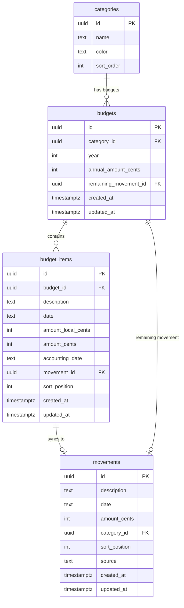

# feat: Add annual budgets with sync to accounting

## Overview

Add a budget system where the user creates annual budgets linked to categories, tracks expenses in local currency (soles) and USD, and syncs individual items to the main movements table when ready. Each budget auto-manages an EOY "[Remaining]" movement that reflects the unspent balance.

## Problem Statement

The user tracks annual spending budgets in a spreadsheet alongside their movements. Budgets have a dual-currency workflow (soles → USD) and a "sync to accounting" action that creates movements in the main table. This manual process needs to move into cajita to eliminate the spreadsheet dependency.

## Proposed Solution

Two new tables (`budgets` and `budget_items`) with a link back to the `movements` table when items are synced. A new `source` column on movements distinguishes manual entries from budget-synced and budget-remaining entries (see brainstorm: `docs/brainstorms/2026-03-09-annual-budgets-brainstorm.md`).

**Key design decisions from brainstorm:**
- Separate entity with sync link (Approach A) — not embedded in categories or movements
- USD required before sync; soles is informational
- EOY remaining = `annual_budget - sum(all items)` regardless of sync status
- Budgets 1:1 with categories, enforced by unique constraint `(category_id, year)`
- Post-sync edits auto-update movement unless frozen by checkpoint
- Start fresh each year, no carry-over

## Data Model

### New table: `budgets`

```sql
CREATE TABLE budgets (
  id UUID PRIMARY KEY DEFAULT gen_random_uuid(),
  category_id UUID NOT NULL REFERENCES categories(id) ON DELETE RESTRICT,
  year INTEGER NOT NULL,
  annual_amount_cents INTEGER NOT NULL,  -- positive, represents spending limit
  remaining_movement_id UUID REFERENCES movements(id) ON DELETE SET NULL,
  created_at TIMESTAMPTZ NOT NULL DEFAULT now(),
  updated_at TIMESTAMPTZ NOT NULL DEFAULT now(),
  UNIQUE (category_id, year)
);
```

### New table: `budget_items`

```sql
CREATE TABLE budget_items (
  id UUID PRIMARY KEY DEFAULT gen_random_uuid(),
  budget_id UUID NOT NULL REFERENCES budgets(id) ON DELETE CASCADE,
  description TEXT NOT NULL DEFAULT '',
  date TEXT NOT NULL,  -- date the expense occurred
  amount_local_cents INTEGER,  -- soles, nullable/informational
  amount_cents INTEGER NOT NULL DEFAULT 0,  -- USD cents, required before sync
  accounting_date TEXT,  -- date used when syncing to movements
  movement_id UUID REFERENCES movements(id) ON DELETE SET NULL,  -- link to synced movement
  sort_position INTEGER NOT NULL DEFAULT 0,
  created_at TIMESTAMPTZ NOT NULL DEFAULT now(),
  updated_at TIMESTAMPTZ NOT NULL DEFAULT now()
);
```

### Modify table: `movements`

Add a `source` column to distinguish movement origins:

```sql
ALTER TABLE movements ADD COLUMN source TEXT NOT NULL DEFAULT 'manual';
-- Values: 'manual', 'budget_sync', 'budget_remaining'
```

This solves: identifying EOY remaining movements (no fragile string matching), making system-managed movements non-editable in the UI, and allowing the UI to show provenance.



### Sign conventions

| Field | Sign | Example |
|-------|------|---------|
| `budgets.annual_amount_cents` | Positive | $500 → 50000 |
| `budget_items.amount_cents` | Negative (expense) | -$55.42 → -5542 |
| `budget_items.amount_local_cents` | Negative (expense) | -S/185.38 → -18538 |
| Synced movement `amount_cents` | Same as item (negative) | -5542 |
| EOY remaining movement `amount_cents` | Negative (projected expense) | -(annual - |sum(items)|) |

The remaining is negative because it represents money you expect to spend. `annual_amount_cents + sum(item.amount_cents)` gives the remaining (since items are negative, this naturally reduces).

### Key constraints

- `ON DELETE RESTRICT` on `budgets.category_id` — cannot delete a category that has budgets
- `ON DELETE CASCADE` on `budget_items.budget_id` — deleting a budget removes its items
- `ON DELETE SET NULL` on `budget_items.movement_id` — if a synced movement is somehow deleted, the item loses its link but survives
- `UNIQUE (category_id, year)` — one budget per category per year

## Edge Cases & Resolutions

### EOY remaining vs checkpoint freeze

The EOY remaining movement is dated Dec 31. If a checkpoint exists past that date, the movement is frozen and can't be auto-updated. **Resolution:** When recalculating the remaining, if the movement is frozen, skip the update silently. The stale amount is acceptable because the checkpoint already verified the balance at that point. Show a small indicator in the budget UI: "Remaining not synced — accounting is frozen past this date."

### Budget deletion with synced items

If synced movements exist and are **unfrozen**: delete the movements along with the budget (CASCADE through items, SET NULL on movement_id, then delete orphaned movements). If any synced movement is **frozen**: block deletion with an error ("Unfreeze first").

### Manual editing of budget-managed movements

Movements with `source = 'budget_sync'` or `source = 'budget_remaining'` are non-editable in the MovementsTable UI (similar to frozen rows, but always). Users must edit via the budget interface.

### Unsync a budget item

Supported for unfrozen movements only. Deletes the linked movement and clears `budget_item.movement_id`. The item returns to unsynced state.

### Snapshot restore interaction

Snapshots currently store movements as JSONB. Budget-linked movements would be included. On restore, `budget_items.movement_id` references may break. **Resolution for now:** Accept this — it's an edge case and snapshots are a safety net, not a primary workflow. A future improvement could include budget tables in snapshots.

## Acceptance Criteria

- [x] User can create a budget for a category + year with an annual USD amount
- [x] User can add items to a budget with description, date, optional soles amount, USD amount
- [x] EOY "[Remaining] Category" movement auto-created in movements table on budget creation
- [x] EOY movement auto-updates when items are added/edited/deleted (unless frozen)
- [x] User can sync an item to accounting (requires USD + accounting date), creating a linked movement
- [x] Synced items show a visual indicator and their accounting date
- [x] Editing a synced item auto-updates the linked movement (if not frozen)
- [x] Frozen synced items are locked (cannot edit budget item)
- [x] User can unsync an item (if movement is not frozen), which deletes the movement
- [x] Budget overview shows: annual amount, total spent, remaining, % spent
- [x] Movements with `source != 'manual'` are non-editable in MovementsTable
- [x] Budget deletion blocked if any synced movement is frozen
- [x] Data syncs across tabs via ElectricSQL
- [x] Server-side validation: sync rejected if USD is 0, duplicate budget per category/year rejected

## Implementation Phases

### Phase 1: Database & Server

**Files:**
- `src/db/migrations/004_budgets.ts` (new)
- `src/db/schema.ts` (add BudgetsTable, BudgetItemsTable, add `source` to MovementsTable)
- `src/server/budgets.ts` (new — CRUD for budgets)
- `src/server/budget-items.ts` (new — CRUD + sync/unsync for items)
- `src/server/movements.ts` (update — respect `source` in freeze/edit guards)
- `src/routes/api/electric/$table.ts` (add `'budgets'`, `'budget_items'` to ALLOWED_TABLES)

**Migration 004_budgets.ts:**
1. Add `source` column to movements (default 'manual')
2. Create `budgets` table with unique constraint
3. Create `budget_items` table with FKs
4. Add indexes on `(budget_id)`, `(movement_id)`, `(category_id, year)`

**Server functions — `budgets.ts`:**
- `createBudget({ category_id, year, annual_amount_cents })` — validates uniqueness, creates budget, creates EOY remaining movement, stores `remaining_movement_id`
- `updateBudget({ id, annual_amount_cents })` — updates budget, recalculates EOY remaining movement
- `deleteBudget({ id })` — checks for frozen synced movements, deletes budget + items + linked movements

**Server functions — `budget-items.ts`:**
- `createBudgetItem({ budget_id, description, date, amount_local_cents, amount_cents })` — creates item, recalculates EOY remaining
- `updateBudgetItem({ id, ... })` — updates item, if synced + unfrozen updates linked movement, recalculates EOY remaining
- `deleteBudgetItem({ id })` — if synced + unfrozen deletes linked movement, recalculates EOY remaining
- `syncBudgetItem({ id, accounting_date })` — validates USD != 0, creates movement (with `source: 'budget_sync'`, category from budget), links back
- `unsyncBudgetItem({ id })` — validates movement not frozen, deletes movement, clears link
- `recalculateRemaining(budgetId)` — helper: `annual_amount_cents + sum(item.amount_cents)`, updates the remaining movement if not frozen

### Phase 2: ElectricSQL Collections

**Files:**
- `src/lib/budgets-collection.ts` (new)
- `src/lib/budget-items-collection.ts` (new)

Both are read-only collections (mutations go through server functions, not optimistic updates). Same pattern as `checkpoints-collection.ts`.

### Phase 3: UI — Budget List Page

**Files:**
- `src/routes/_authenticated/budgets.tsx` (new route)
- `src/components/BudgetList.tsx` (new)

Budget list page at `/budgets`:
- Grouped by year (current year first)
- Each budget card shows: category name + color, annual amount, total spent, remaining, % progress bar
- "Add Budget" button → select category (only those without a budget this year), enter annual amount
- Click a budget → drills into the budget items view

### Phase 4: UI — Budget Items View

**Files:**
- `src/components/BudgetDetail.tsx` (new)
- `src/components/BudgetItemRow.tsx` (new)
- `src/components/SyncPopover.tsx` (new)

Budget detail view (could be a separate route or inline expand):
- Header: budget name, annual amount, remaining, progress bar
- Table of items: date, description, soles (if present), USD, sync status, actions
- "Add Item" button
- Sync action per row: opens SyncPopover (accounting date picker + confirm)
- Synced rows show accounting date + link icon
- Frozen synced rows show lock icon (same as movements)
- Unsync action (if not frozen)

### Phase 5: UI — MovementsTable Integration

**Files:**
- `src/components/MovementsTable.tsx` (modify)

Changes:
- Read `source` from each movement
- Movements with `source = 'budget_sync'` or `source = 'budget_remaining'`: non-editable (pass `disabled` to EditableCell), show a budget icon instead of trash/lock
- EOY remaining movements show with a distinctive style (e.g., italic or lighter color)

### Phase 6: Navigation

**Files:**
- `src/components/Layout.tsx` or equivalent (modify to add budgets nav link)

Add "Budgets" to the app navigation alongside "Movements".

## Sources

- **Origin brainstorm:** [docs/brainstorms/2026-03-09-annual-budgets-brainstorm.md](docs/brainstorms/2026-03-09-annual-budgets-brainstorm.md) — Key decisions: separate entity with sync link, USD required before sync, EOY remaining computed from all items, 1:1 with categories, freeze-aware edits
- **Existing patterns:** `src/db/migrations/003_checkpoints.ts`, `src/server/checkpoints.ts`, `src/lib/checkpoints-collection.ts`, `src/components/MovementsTable.tsx`
- **Checkpoint interaction:** `src/server/movements.ts` (isMovementFrozen helper)
