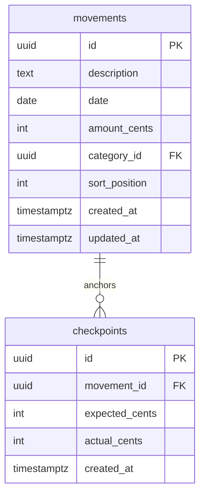

# feat: Add reconciliation checkpoints

## Overview

Add the ability to "freeze" movements up to a specific row after verifying the running total matches the real bank+cash balance. This creates a reconciliation checkpoint that prevents accidental edits to already-verified history.

## Problem Statement

The user periodically syncs with their bank account, enters missing movements, and then verifies the running total matches reality. Currently there's no way to mark a point as "reconciled" or prevent edits to verified history — any accidental edit to an old movement silently breaks the reconciliation.

## Proposed Solution

A checkpoint system anchored to specific movement rows (see brainstorm: `docs/brainstorms/2026-03-09-reconciliation-checkpoints-brainstorm.md`).

**User flow:**
1. Click a lock icon on a movement row → popover appears
2. Enter real bank+cash balance → system shows expected vs actual and difference
3. Confirm → checkpoint created, all movements at or before that row become read-only
4. Visual divider below the checkpoint boundary separates frozen from editable rows

## Data Model

### New table: `checkpoints`

```sql
CREATE TABLE checkpoints (
  id UUID PRIMARY KEY DEFAULT gen_random_uuid(),
  movement_id UUID NOT NULL REFERENCES movements(id) ON DELETE RESTRICT,
  expected_cents INTEGER NOT NULL,
  actual_cents INTEGER NOT NULL,
  created_at TIMESTAMPTZ NOT NULL DEFAULT now()
);

CREATE INDEX idx_checkpoints_created ON checkpoints(created_at DESC);
```



**Key constraints:**
- `ON DELETE RESTRICT` — cannot delete a movement that has a checkpoint on it
- `actual_cents` can be any integer (including zero or negative — the user's real balance might genuinely be negative or zero)
- No unique constraint on movement_id — multiple historical checkpoints can reference the same movement, but only the latest (by `created_at`) is "active"

### Freeze boundary logic

A movement is **frozen** if there's an active checkpoint and:
```
movement.date < checkpoint_movement.date
OR (movement.date === checkpoint_movement.date AND movement.sort_position <= checkpoint_movement.sort_position)
```

This is computed client-side in `useMemo`, same as running totals. The checkpoint movement itself IS frozen (it's the last verified row).

## Acceptance Criteria

- [x] User can click a lock icon on any movement row to start checkpoint creation
- [x] Popover shows: expected balance (running total at that row), input for actual balance, computed difference
- [x] Confirming creates a checkpoint record and freezes all movements at or before that row
- [x] Frozen rows are visually muted (reduced opacity, no hover highlight)
- [x] Frozen rows cannot be edited (EditableCell is non-interactive)
- [x] Frozen rows cannot be deleted (trash icon hidden)
- [x] A visual divider appears below the freeze boundary showing checkpoint info
- [x] "Add Movement" always inserts after the checkpoint (today's date, sort_position after checkpoint if same date)
- [x] An "Unfreeze" button on the divider deletes the latest checkpoint, behind a confirmation
- [x] Checkpoint data syncs across tabs via ElectricSQL
- [x] Server-side enforcement: `updateMovement` and `deleteMovement` reject operations on frozen movements

## Implementation Phases

### Phase 1: Database & Server

**Files:**
- `src/db/migrations/003_checkpoints.ts` (new)
- `src/db/schema.ts` (add `CheckpointsTable` interface, add to `Database`)
- `src/server/checkpoints.ts` (new)
- `src/routes/api/electric/$table.ts` (add `'checkpoints'` to `ALLOWED_TABLES`)

**Migration** — `003_checkpoints.ts`:
```typescript
export async function up(db: Kysely<unknown>): Promise<void> {
  await db.schema
    .createTable('checkpoints')
    .addColumn('id', 'uuid', (col) => col.primaryKey().defaultTo(sql`gen_random_uuid()`))
    .addColumn('movement_id', 'uuid', (col) =>
      col.notNull().references('movements.id').onDelete('restrict'))
    .addColumn('expected_cents', 'integer', (col) => col.notNull())
    .addColumn('actual_cents', 'integer', (col) => col.notNull())
    .addColumn('created_at', 'timestamptz', (col) => col.notNull().defaultTo(sql`now()`))
    .execute()

  await db.schema
    .createIndex('idx_checkpoints_created')
    .on('checkpoints')
    .column('created_at')
    .execute()
}

export async function down(db: Kysely<unknown>): Promise<void> {
  await db.schema.dropTable('checkpoints').execute()
}
```

**Server functions** — `src/server/checkpoints.ts`:
- `createCheckpoint({ movement_id, actual_cents })` — validates movement exists, stores expected_cents from current running total query, returns checkpoint
- `deleteCheckpoint({ id })` — deletes checkpoint (for unfreeze)
- `getLatestCheckpoint()` — returns latest checkpoint with its movement's date and sort_position (for freeze boundary)

**Guard frozen movements** — update `src/server/movements.ts`:
- `updateMovement`: before updating, check if movement is frozen (query latest checkpoint, compare date/sort_position). Return 403 if frozen.
- `deleteMovement`: same check. Return 403 if frozen.

### Phase 2: ElectricSQL Collection

**Files:**
- `src/lib/checkpoints-collection.ts` (new)

```typescript
// Read-only collection — checkpoints are created/deleted via server functions,
// not optimistic mutations (they need server-side validation)
const checkpointSchema = z.object({
  id: z.string(),
  movement_id: z.string(),
  expected_cents: z.coerce.number(),
  actual_cents: z.coerce.number(),
  created_at: z.string(),
})

export type Checkpoint = z.infer<typeof checkpointSchema>

export const checkpointsCollection = createCollection(
  electricCollectionOptions({
    id: 'checkpoints',
    shapeOptions: {
      url: typeof window !== 'undefined'
        ? `${window.location.origin}/api/electric/checkpoints`
        : '/api/electric/checkpoints',
    },
    getKey: (item: Checkpoint) => item.id,
    schema: checkpointSchema,
    // No mutation handlers — read-only, server-authoritative
  }),
)
```

**Why read-only:** Checkpoint creation requires server-side validation (verifying the movement exists, computing expected_cents from DB). Unlike movements which use optimistic updates, checkpoints are server-authoritative. The UI calls server functions directly and the result syncs back via ElectricSQL.

### Phase 3: UI — Freeze Logic & Row Styling

**Files:**
- `src/components/MovementsTable.tsx` (modify)
- `src/components/EditableCell.tsx` (modify — add `disabled` prop)

**MovementsTable changes:**

1. Query checkpoints via `useLiveQuery` on `checkpointsCollection`
2. Find the latest checkpoint (max `created_at`)
3. Look up the checkpoint's anchor movement to get its `date` and `sort_position`
4. In the `allWithTotals` memo, add a `frozen` boolean to each `MovementWithTotal`
5. Pass `frozen` to row rendering:
   - Frozen rows: add `opacity-50` class, remove `hover:bg-gray-50`
   - Frozen rows: hide trash button, pass `disabled` to EditableCell
   - Frozen rows: show lock icon instead of trash
6. After the last frozen row, render a checkpoint divider

**EditableCell changes:**

Add a `disabled?: boolean` prop. When true:
- Read mode: remove `cursor-pointer` and `hover:bg-gray-100`, just display text
- Never enter edit mode (ignore clicks)

### Phase 4: UI — Checkpoint Creation Popover

**Files:**
- `src/components/CheckpointPopover.tsx` (new)
- `src/components/MovementsTable.tsx` (modify — add lock icon to unfrozen rows)

**Lock icon:** On each unfrozen row, show a small lock icon (from lucide-react `Lock`) in the actions column area. Clicking it opens the `CheckpointPopover` anchored to that row.

**CheckpointPopover:**
- Small popover/card (not a full modal) positioned near the clicked row
- Shows:
  - **Expected:** `formatCents(row.total_cents)` (the running total at this row)
  - **Actual:** dollar input field (auto-focused)
  - **Difference:** computed live as user types (`actual - expected`), colored green if 0, red otherwise
- Buttons: "Reconcile" (confirm) and "Cancel"
- On confirm: call `createCheckpoint` server function, close popover
- On cancel or click-away: close popover
- Keyboard: Escape closes, Enter confirms

### Phase 5: UI — Checkpoint Divider & Unfreeze

**Files:**
- `src/components/MovementsTable.tsx` (modify)

**Checkpoint divider:** Rendered as a special row between the last frozen row and the first unfrozen row. It's not a virtualizer row — it's an absolutely positioned element at the correct offset.

Content:
- Left: lock icon + "Reconciled" label
- Center: `Expected: $X | Actual: $Y | Diff: $Z`
- Right: "Unfreeze" button (small, text-only, muted color)

**Unfreeze flow:**
- Click "Unfreeze" → confirmation: "This will unlock N movements for editing. Are you sure?"
- Confirm → call `deleteCheckpoint` server function
- The checkpoint syncs away via ElectricSQL, UI reactively unfreezes all rows

### Phase 6: Guard "Add Movement" insertion point

**Files:**
- `src/components/MovementsTable.tsx` (modify `handleAdd`)

Current `handleAdd` inserts with today's date and `maxPos + 1000` for that date. With a checkpoint:

- If checkpoint movement's date < today: no change needed (new movement is after checkpoint by date)
- If checkpoint movement's date === today: ensure new movement's `sort_position` is > checkpoint movement's `sort_position`. Use `Math.max(maxPos, checkpointMovement.sort_position) + 1000`
- If checkpoint movement's date > today: this shouldn't happen (checkpoint is always on a past or current date), but defensively use checkpoint movement's sort_position + 1000

## Sources

- **Origin brainstorm:** [docs/brainstorms/2026-03-09-reconciliation-checkpoints-brainstorm.md](docs/brainstorms/2026-03-09-reconciliation-checkpoints-brainstorm.md) — Key decisions: freeze on row (not date), real balance required, only one active checkpoint, unfreezing is deliberate
- **Existing patterns:** `src/db/migrations/002_movements.ts`, `src/server/movements.ts`, `src/lib/movements-collection.ts`
