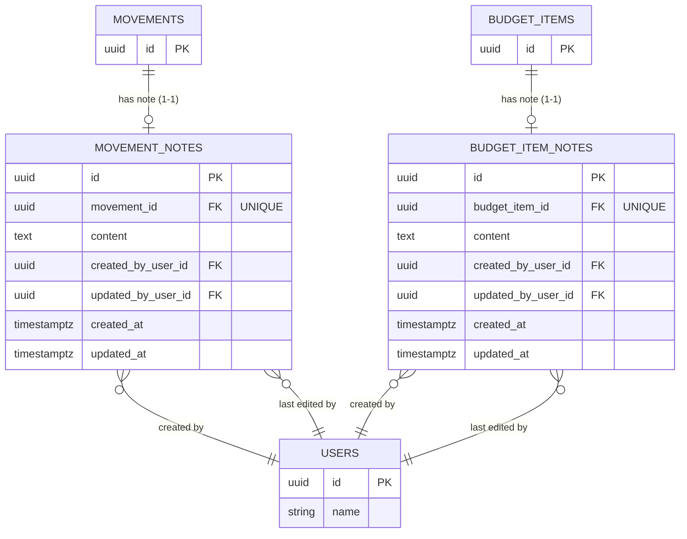

# feat: Add Notes to Movements and Budget Items

## Overview

Add a single rich-text note field to each movement and budget item. Users click a note icon on any row to open a Radix UI Popover containing a Tiptap WYSIWYG editor. Notes show who last edited them (resolved from a new users collection). Notes survive checkpoint freezing — they are annotations, not financial data.

(see brainstorm: docs/brainstorms/2026-04-03-movement-notes-brainstorm.md)

## Proposed Solution

Seven focused changes, in dependency order:

1. DB migration adding three columns to both tables
2. New server functions for note updates (separate from financial updates, skips freeze checks)
3. New `usersCollection` for resolving author names
4. Updated Zod schemas on both collections
5. `NotePopover` component (Radix + Tiptap)
6. Note icon wired into `MovementsTable` row actions
7. Note icon wired into `BudgetItemRow` actions column

---

## Technical Considerations

### Data model
Two dedicated join tables, one per parent entity. No columns added to `movements` or `budget_items`.

**`movement_notes`**
```
id            uuid PK
movement_id   uuid UNIQUE NOT NULL REFERENCES movements(id) ON DELETE CASCADE
content       text NOT NULL
created_by_user_id  uuid NOT NULL REFERENCES users(id) ON DELETE SET NULL (nullable in practice)
updated_by_user_id  uuid NOT NULL REFERENCES users(id) ON DELETE SET NULL (nullable in practice)
created_at    timestamptz NOT NULL DEFAULT now()
updated_at    timestamptz NOT NULL DEFAULT now()
```

**`budget_item_notes`**
```
id                  uuid PK
budget_item_id      uuid UNIQUE NOT NULL REFERENCES budget_items(id) ON DELETE CASCADE
content             text NOT NULL
created_by_user_id  uuid NOT NULL REFERENCES users(id) ON DELETE SET NULL
updated_by_user_id  uuid NOT NULL REFERENCES users(id) ON DELETE SET NULL
created_at          timestamptz NOT NULL DEFAULT now()
updated_at          timestamptz NOT NULL DEFAULT now()
```

The UNIQUE constraint on `movement_id` / `budget_item_id` enforces 1-1 at the DB level. The server uses INSERT … ON CONFLICT (movement_id) DO UPDATE to upsert: on first save `created_by_user_id` is set from session and never touched again; `updated_by_user_id` is always overwritten. Clearing the content deletes the row entirely (the icon then reverts to muted).

### Dedicated note server functions
`updateMovement` currently throws `'Cannot edit a frozen movement'` on any write. Notes must bypass this. Two new server functions handle note upserts:
- `upsertMovementNote({ movement_id, content })` — upserts `movement_notes` via INSERT … ON CONFLICT DO UPDATE; sets `created_by_user_id` on insert only, always sets `updated_by_user_id` and `updated_at` from session; skips freeze check entirely
- `upsertBudgetItemNote({ budget_item_id, content })` — same pattern for `budget_item_notes`
- `deleteMovementNote({ movement_id })` — deletes the row when content is cleared
- `deleteBudgetItemNote({ budget_item_id })` — same

Empty or whitespace-only `content` triggers the delete path instead of upsert.

### User name resolution
There is no existing `users` collection in the codebase. A new lightweight one is added:
- `/api/electric/team_members` endpoint — proxies the `users` table, `WHERE id IN (SELECT user_id FROM team_memberships WHERE team_id = $teamId)`
- `src/lib/team-members-collection.ts` — `usersSchema: z.object({ id, name })`, read-only collection
- `note_user_id` is resolved client-side by looking up this collection

The current user's ID is available via `Route.useRouteContext()` → `user.id`.

### ElectricSQL sync
The new `movement_notes` and `budget_item_notes` tables need their own Electric shapes and collections — similar to how `budgetItemsCollection` works today. Two new read-only collections:
- `src/lib/movement-notes-collection.ts` — syncs all `movement_notes` for the team (scoped via movement's `team_id` join, or via a WHERE clause on the proxy)
- `src/lib/budget-item-notes-collection.ts` — syncs all `budget_item_notes` for the team

The existing `movementsCollection` and `budgetItemsCollection` schemas are unchanged — no new columns added there.

### Tiptap + Radix Popover in a virtualizer
- `Popover.Root` uses controlled state keyed to row ID, held at the parent table level
- `Popover.Content` is always inside `Popover.Portal` (escapes the `transform` stacking context created by virtual rows)
- `hideWhenDetached` is set so the popover closes when a row scrolls out of the virtual window
- `immediatelyRender: false` on `useEditor` to avoid SSR hydration mismatch

### Save UX
- Explicit **Save** button in the popover footer — the only save path
- Clicking outside or pressing Escape closes the popover and **discards** unsaved changes
- No auto-save, no "you have unsaved changes" confirmation for v1 (simpler contract)
- No conflict detection for v1 (last-write-wins)
- Content cap: 10 000 characters, enforced client-side (character counter) and server-side (Zod `max`)
- If save fails, popover stays open and shows an inline error

### Note icon placement on frozen movements
The current guard `{!frozen && <RowActionsMenu />}` in `MovementsTable` hides the entire actions area for frozen rows. The note icon must be rendered outside this guard.

### Notes on BudgetItem vs. linked Movement
The note on a `BudgetItem` and the note on its synced `Movement` are intentionally independent — budget notes describe planning intent; movement notes describe accounting reality. No propagation on sync/unsync.

---

## System-Wide Impact

- **Interaction graph:** `NotePopover` save → `updateMovementNote` / `updateBudgetItemNote` → DB write → ElectricSQL shape update → `movementsCollection` / `budgetItemsCollection` live query re-render → icon color updates
- **Freeze check bypass:** `updateMovementNote` explicitly does NOT call `isMovementFrozen`. This is intentional and documented.
- **Consistent save path for both tables:** Notes call `upsertMovementNote` / `upsertBudgetItemNote` directly and rely on ElectricSQL to sync the `movement_notes` / `budget_item_notes` collections back. No optimistic mutation — the note tables are read-only collections, same pattern as `budgetItemsCollection`. The slight latency (one ElectricSQL round-trip) is acceptable for annotations.
- **State lifecycle risks:** `created_by_user_id` is set server-side on INSERT and never touched on UPDATE. `updated_by_user_id` is always overwritten. The icon color, creator name, and editor name all update once ElectricSQL syncs the note row back after a save or delete.
- **Cascade deletes:** Both note tables use `ON DELETE CASCADE` on the parent FK, so deleting a movement or budget item automatically removes its note.

---

## Acceptance Criteria

- [ ] A note icon (e.g. `MessageSquare` from Lucide) appears in the actions area of every movement row and every budget item row
- [ ] Icon is muted gray when `note_content` is null; colored (e.g. `text-amber-500`) when a note exists
- [ ] Clicking the icon opens a Radix UI Popover containing a Tiptap editor
- [ ] Editor supports bold, italic, and link insertion via a minimal toolbar
- [ ] Saving a note upserts the note row; `created_by_user_id` is set once on first save, `updated_by_user_id` always reflects the most recent saver
- [ ] Popover shows "Created by [name]" and, if different, "Last edited by [name] · [relative time]"
- [ ] Clearing the editor and saving deletes the note row entirely; icon reverts to muted
- [ ] Notes can be written and edited on frozen (checkpointed) movements
- [ ] Notes on a `BudgetItem` and its linked `Movement` are independent
- [ ] Character count is shown; saving is blocked above 10 000 chars
- [ ] Clicking outside or pressing Escape closes the popover and discards unsaved changes
- [ ] If save fails, popover remains open and shows an inline error message
- [ ] If the open popover's row scrolls out of the virtual window, the popover closes (via `hideWhenDetached`) and unsaved content is discarded
- [ ] Note icon appears unconditionally on frozen rows (not gated behind `!frozen`)
- [ ] The Popover uses `Popover.Portal` and `hideWhenDetached` to work correctly inside the virtualizer

---

## Dependencies & Risks

- **Install:** `@radix-ui/react-popover`, `@tiptap/react`, `@tiptap/pm`, `@tiptap/starter-kit`, `@tiptap/extension-link`
- **Risk — Tiptap bundle size:** Tiptap + ProseMirror adds ~100 KB gzipped. Acceptable for a desktop financial tool; worth a quick bundle check after install.
- **Risk — Virtualizer + Popover interaction:** Controlled state at the parent table level prevents orphaned popovers when rows unmount. `hideWhenDetached` handles scroll-out-of-view. Must be tested.
- **Risk — Electric shape for users:** The `team_memberships` table is used for scoping but may not be exposed through the Electric proxy. The endpoint may need a custom SQL shape query instead of a simple table proxy.

---

## ERD Changes



---

## Files to Create / Modify

### New files
| File | Purpose |
|---|---|
| `src/db/migrations/013_add_notes.ts` | CREATE TABLE movement_notes + budget_item_notes |
| `src/db/schema.ts` additions | `MovementNotesTable` and `BudgetItemNotesTable` types |
| `src/server/notes.ts` | `upsertMovementNote`, `upsertBudgetItemNote`, `deleteMovementNote`, `deleteBudgetItemNote` |
| `src/lib/movement-notes-collection.ts` | Read-only ElectricSQL collection for movement_notes |
| `src/lib/budget-item-notes-collection.ts` | Read-only ElectricSQL collection for budget_item_notes |
| `src/lib/team-members-collection.ts` | Read-only ElectricSQL collection for user id+name (creator/editor display) |
| `src/routes/api/electric/movement_notes.ts` | Electric proxy endpoint |
| `src/routes/api/electric/budget_item_notes.ts` | Electric proxy endpoint |
| `src/routes/api/electric/team_members.ts` | Electric proxy endpoint scoped to team |
| `src/components/NotePopover.tsx` | Radix Popover + Tiptap editor component |

### Modified files
| File | Change |
|---|---|
| `src/components/MovementsTable.tsx` | Add note icon + controlled popover state; move note icon outside `!frozen` guard |
| `src/components/BudgetItemRow.tsx` | Add note icon + popover; column may need slight width adjustment |

---

## Sources

- **Origin brainstorm:** [docs/brainstorms/2026-04-03-movement-notes-brainstorm.md](docs/brainstorms/2026-04-03-movement-notes-brainstorm.md)
  - Key decisions carried forward: single note (not thread), Radix Popover, Tiptap editor, user_id stored (not name snapshot), anyone on team can edit, note icon on every row
- Radix Popover + virtualizer pattern: `hideWhenDetached`, controlled state keyed to row ID, always `Popover.Portal`
- Tiptap SSR gotcha: `immediatelyRender: false` required
- Freeze check bypass pattern: new `updateMovementNote` server function instead of patching `updateMovement`
