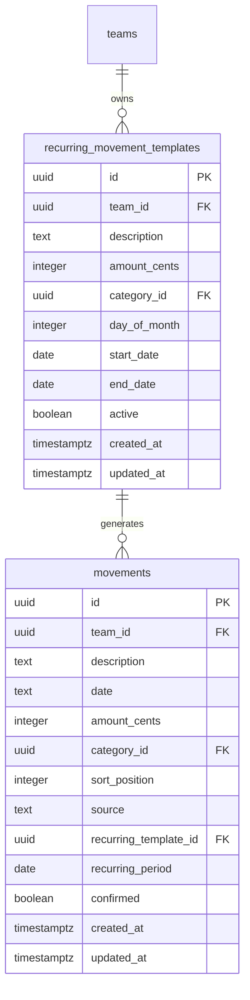

# feat: Recurring Movement Templates

## Overview

Add a recurring movement template system that auto-generates monthly placeholder movements (salary, mortgage, mom's help, income tax, budget transfer) in advance. During the user's biweekly sync, they find the generated placeholder, adjust the date/amount to match reality, and confirm it. Unconfirmed future movements naturally extend the running balance total, providing a year-end forecast without any additional computation.

This eliminates the manual overhead of maintaining a spreadsheet with pre-entered future entries and replaces the `[Remaining]` workaround entirely.

---

## Problem Statement

The user's biweekly sync workflow has one persistent source of friction: recurring obligations (salary, mortgage, family help, income tax retention, budget transfer) must be manually pre-entered in a spreadsheet as future placeholders. When the real event occurs, the user must find the placeholder and adjust its date and amount. This is repetitive, error-prone, and currently lives entirely outside the app.

The spreadsheet also serves a forecasting role: because future recurring entries are pre-populated, the running balance column shows a projected year-end figure. This functionality has no equivalent in the app today.

---

## Proposed Solution

### Core Model

A `recurring_movement_templates` table holds templates (description, amount, day of month, category, date range). A server-side generation function runs idempotently on each page load of the movements screen, inserting placeholder `movements` rows for all months up to the generation horizon. Each generated movement carries:

- `source: 'recurring'` — enables visual distinction and targeted logic
- `recurring_template_id` — FK back to the template
- `recurring_period` — a `date` column set to the first of the month the instance represents (e.g., `2026-04-01`), used for idempotency via a unique constraint
- `confirmed: false` — flips to `true` when the user verifies it during sync

Unconfirmed future movements render with a distinct visual style (lighter, italic, clock icon). Since they are real rows in the movements table, the running total column automatically shows the projected year-end balance without any extra computation.

### Generation Strategy

- **Triggered**: on every load of the `/finances/movements` route (server-side, inside the loader)
- **Horizon**: from each template's `start_date` through the end of the current year + 3 months ahead
- **Idempotent**: unique constraint on `(recurring_template_id, recurring_period)` — concurrent page loads in multiple tabs cannot produce duplicates
- **Date clamping**: if `day_of_month` exceeds the days in a given month, clamp to the last valid day (e.g., day 31 in February → Feb 28/29)
- **Catch-up**: if the app hasn't been opened for months, generation catches up from the last generated period to the current horizon in a single pass

### Confirmation UX

During biweekly sync, unconfirmed recurring movements appear in the movements list. The user:
1. Adjusts the `date` and/or `amount_cents` to match what actually hit their bank account
2. Clicks **Confirm** in the row actions menu (visible only for unconfirmed recurring movements)

After confirmation: `confirmed = true`, the visual distinction is removed, and the row behaves like a normal editable movement. The `recurring_template_id` is retained for historical traceability.

### Forecasting

Because future unconfirmed movements are real rows, the existing running total column in `MovementsTable` naturally extends into the future. However, showing a single total would be ambiguous — the user can't tell if the header figure represents their actual current balance or a projection.

**The header shows two distinct figures:**

- **Current balance** — sum of confirmed movements with `date ≤ today` only. This is what you actually have right now.
- **Projected year-end** — sum of all movements (confirmed + unconfirmed recurring) through December 31. This is the forecast.

A visual "today" divider in the movements list separates the confirmed past from the projected future, reinforcing the distinction between real and estimated entries. The running total column per row continues to include all rows, but the transition across the "today" divider makes it clear when the numbers shift from actual to projected.

---

## Technical Approach

### Architecture

```
recurring_movement_templates (new table)
        │
        │ 1:many
        ▼
movements (extended with recurring_template_id, recurring_period, confirmed)
        │
        │ existing FK
        ▼
budget_items (unchanged — recurring movements can still be linked to budget items)
```

### Phase 1 — DB Schema

**Migration `016_recurring_movement_templates.ts`**

```sql
-- New table
CREATE TABLE recurring_movement_templates (
  id uuid PRIMARY KEY DEFAULT gen_random_uuid(),
  team_id uuid NOT NULL REFERENCES teams(id) ON DELETE CASCADE,
  description text NOT NULL,
  amount_cents integer NOT NULL,
  category_id uuid REFERENCES categories(id) ON DELETE SET NULL,
  day_of_month integer NOT NULL CHECK (day_of_month BETWEEN 1 AND 31),
  start_date date NOT NULL,
  end_date date,
  active boolean NOT NULL DEFAULT true,
  created_at timestamptz NOT NULL DEFAULT now(),
  updated_at timestamptz NOT NULL DEFAULT now()
);

CREATE INDEX idx_recurring_movement_templates_team_id
  ON recurring_movement_templates (team_id);

-- Extend movements table
ALTER TABLE movements
  ADD COLUMN recurring_template_id uuid
    REFERENCES recurring_movement_templates(id) ON DELETE SET NULL,
  ADD COLUMN recurring_period date,  -- always the 1st of the represented month
  ADD COLUMN confirmed boolean NOT NULL DEFAULT true;
  -- Default true so existing movements are treated as confirmed.
  -- Generated recurring instances are inserted with confirmed = false.

CREATE UNIQUE INDEX idx_movements_recurring_period
  ON movements (recurring_template_id, recurring_period)
  WHERE recurring_template_id IS NOT NULL;
```

**`src/db/schema.ts` additions:**

```ts
export interface RecurringMovementTemplatesTable {
  id: Generated<string>
  team_id: string
  description: string
  amount_cents: number
  category_id: string | null
  day_of_month: number
  start_date: string  // YYYY-MM-DD
  end_date: string | null
  active: Generated<boolean>
  created_at: Generated<Date>
  updated_at: Generated<Date>
}

// Extend MovementsTable:
// recurring_template_id: string | null
// recurring_period: string | null  (YYYY-MM-DD, always 1st of month)
// confirmed: Generated<boolean>
```

---

### Phase 2 — Generation Engine

**`src/server/recurring-movements.ts`** (new file)

```ts
// generateRecurringMovements(teamId: string): Promise<void>
//
// Algorithm:
// 1. Fetch all active templates for the team
// 2. Compute horizon = last day of (current year + 3 months)
// 3. For each template:
//    a. Determine generation range: max(template.start_date, today - 1 month) → horizon
//       (also respect template.end_date if set)
//    b. Iterate month by month:
//       - Clamp day_of_month to last valid day of that month
//       - recurring_period = first of that month (YYYY-MM-01)
//       - INSERT INTO movements ... ON CONFLICT (recurring_template_id, recurring_period) DO NOTHING
//       - source = 'recurring', confirmed = false
//       - sort_position = MAX(sort_position) + 1000 for that date
// 4. Return — ElectricSQL syncs new rows to all clients automatically

export const generateRecurringMovements = createServerFn({ method: 'POST' })
  .middleware([authMiddleware])
  .handler(async ({ context }) => {
    const teamId = context.user.teamId
    // ... generation logic
  })
```

Key details:
- Uses `INSERT ... ON CONFLICT DO NOTHING` (backed by the unique index) — race-condition safe
- Scoped strictly to `teamId`
- Does not touch confirmed movements or movements before the current checkpoint boundary (past generation is skipped — templates with `start_date` in the past only generate from the current month forward, unless there are gaps from before the user started using the feature)
- Called from the movements route loader: `src/routes/_authenticated/finances/movements.tsx`

---

### Phase 3 — Template Management UI

**New route: `src/routes/_authenticated/finances/recurring.tsx`**

A dedicated page at `/finances/recurring`, linked from the finances subnav alongside Movements, Budgets, Categories.

Features:
- List of all templates (name, amount, day of month, category, status active/inactive)
- Create template (modal or inline form)
- Edit template
- Deactivate / reactivate template
- Delete template (blocked with explanation if confirmed instances exist; offers to clean up unconfirmed future instances first)

**`src/server/recurring-movements.ts`** server functions:
- `createRecurringTemplate` — validates, inserts, triggers immediate generation pass
- `updateRecurringTemplate` — updates template; cascades amount/description changes to unconfirmed future instances only
- `deactivateRecurringTemplate` — sets `active = false`; leaves existing confirmed instances intact
- `deleteRecurringTemplate` — blocked if confirmed instances exist; cascades delete of unconfirmed future instances via a cleanup query before soft-deleting (or uses `ON DELETE SET NULL` and lets confirmed history persist)

**Cascade update logic for `updateRecurringTemplate`:**

When a template's `amount_cents` or `description` is changed, update all movements WHERE:
- `recurring_template_id = template.id`
- `confirmed = false`
- `date >= today`

This keeps the forecast accurate without touching past confirmed records.

---

### Phase 4 — Movements List Integration

**`src/routes/api/electric/$table.ts`**
- Add `'recurring_movement_templates'` to `ALLOWED_TABLES` and `TEAM_SCOPED_TABLES`

**`src/lib/recurring-movement-templates-collection.ts`** (new, read-only collection)
```ts
export const recurringMovementTemplatesCollection = createCollection(
  electricCollectionOptions({
    id: 'recurring_movement_templates',
    shapeOptions: { url: `${origin}/api/electric/recurring_movement_templates` },
    getKey: (item) => item.id,
    schema: recurringMovementTemplateSchema,
  }),
)
```

**`src/components/MovementsTable.tsx`** — changes:

1. **Fix the `budgetManaged` lock condition (line 295)**:
   ```ts
   // Before (locks any source !== 'manual' with a budget link):
   const budgetManaged = row.source !== 'manual' && movementToBudgetId.has(row.id)

   // After (only locks budget_sync and budget_remaining):
   const budgetManaged =
     (row.source === 'budget_sync' || row.source === 'budget_remaining') &&
     movementToBudgetId.has(row.id)
   ```
   This allows recurring movements (confirmed or not) to be freely edited.

2. **Visual distinction for unconfirmed recurring movements**:
   - Lighter background (e.g., `bg-blue-50/30`)
   - Italic description text
   - Clock icon (`lucide-react: Clock`) in the row, similar to the lock icon for frozen rows
   - Confirm button in `RowActionsMenu` (only visible when `source === 'recurring' && !confirmed`)

3. **"Today" divider**:
   - Insert a visual separator row between the last movement with `date <= today` and the first with `date > today`
   - Shows label: "Today — projected below"
   - Implemented in the same pass that computes the running total, which already iterates movements in order

4. **Confirm server function** in `src/server/recurring-movements.ts`:
   ```ts
   export const confirmRecurringMovement = createServerFn({ method: 'POST' })
     .middleware([authMiddleware])
     .inputValidator(z.object({
       movementId: z.string(),
       date: z.string(),
       amountCents: z.number(),
     }))
     .handler(async ({ data, context }) => {
       // Update date, amount_cents, confirmed = true
       // Verify ownership via teamId
     })
   ```

---

### Phase 5 — Checkpoint Compatibility

**`src/server/budget-helpers.ts` — `createCheckpoint` fix**:

The `expected_cents` calculation currently sums all movements up to the checkpoint boundary. Unconfirmed recurring movements that fall within or before that boundary would inflate the expected value with placeholder amounts.

Fix: exclude unconfirmed recurring movements from the checkpoint sum:
```sql
WHERE confirmed = true OR source != 'recurring'
```

This ensures checkpoints only capture real (confirmed) financial events.

---

## ERD



---

## Alternative Approaches Considered

### Separate `recurring_movement_instances` table
A normalized approach with a join table tracking `(template_id, year, month, movement_id, status)`. Rejected because it adds a third entity the user never directly interacts with, and the unique constraint on `movements.recurring_period` achieves the same idempotency guarantee with less schema complexity.

### Cron / background job generation
Generate instances via a scheduled job (Railway cron or similar). Rejected because the app has no existing background job infrastructure. On-page-load generation is simpler, already team-scoped via the auth context, and fast enough at this data scale.

### `confirmed` as a `source` value change
After confirmation, flip `source` from `'recurring'` to `'manual'`. Rejected because it destroys the historical link between a confirmed movement and its template, making it impossible to know "this salary payment came from the recurring template" for future reference or reporting.

### Implicit confirmation via date-in-past
Mark a recurring movement as confirmed automatically once its `date` is in the past. Rejected because the user's workflow explicitly requires them to verify the movement against their bank statement — silent auto-confirmation would create false confidence in unverified data.

---

## System-Wide Impact

### Interaction Graph
`generateRecurringMovements` (called in loader) → `INSERT INTO movements` with `ON CONFLICT DO NOTHING` → ElectricSQL WAL → movements shape subscription → `movementsCollection` updates → `MovementsTable` re-renders with new rows. The unique index ensures no duplicate rows regardless of concurrent tab loads.

`confirmRecurringMovement` → `UPDATE movements SET confirmed = true, date = ?, amount_cents = ?` → ElectricSQL sync → all clients see confirmed state immediately.

`updateRecurringTemplate` → updates template + `UPDATE movements SET amount_cents = ?, description = ? WHERE recurring_template_id = ? AND confirmed = false AND date >= today` → both `recurring_movement_templates` shape and `movements` shape update on all clients.

### Error & Failure Propagation
- Generation failure (DB error mid-loop): idempotent — the next page load retries from scratch safely. Partial generation is not harmful.
- Confirm failure: server function throws, TanStack server fn error surfaces to UI. No partial state — it's a single UPDATE.
- Template deletion with confirmed instances: server function throws a descriptive error before touching the DB. No cascade delete of real data.

### State Lifecycle Risks
- `recurring_period` uniqueness is enforced at the DB level — the only safe layer for concurrent requests.
- Existing checkpoint history: `confirmed = true` default on the migration backfill means no existing movement is accidentally treated as unconfirmed.
- Templates with `end_date` in the past: generation skips them cleanly; no orphaned future rows.

### Checkpoint Compatibility
Unconfirmed recurring movements are excluded from `expected_cents` computation. Confirmed ones are included (they represent real money).

### Snapshot Compatibility
Existing snapshots captured before this feature ships will not include `confirmed` or `recurring_template_id` columns. The snapshot diff view (`SnapshotPanel`) compares descriptions and amounts — unconfirmed recurring movements will appear as "added" in a diff if a snapshot predates them. This is acceptable for now; a future improvement could filter unconfirmed rows from snapshots.

---

## Acceptance Criteria

### Functional
- [ ] User can create a recurring movement template with: description, amount, day of month (1–31), category (optional), start date, optional end date
- [ ] On loading `/finances/movements`, the system generates placeholder movements for all active templates up to end of current year + 3 months
- [ ] Generation is idempotent — opening the app in multiple tabs does not create duplicate movements
- [ ] `day_of_month` values that exceed a month's length are clamped to the last valid day
- [ ] Unconfirmed recurring movements are visually distinct in the movements table (lighter background, italic, clock icon)
- [ ] A "today" divider separates confirmed past movements from projected future ones
- [ ] The movements header shows two distinct figures: **Current balance** (confirmed, date ≤ today) and **Projected year-end** (all movements through Dec 31)
- [ ] The header label makes the distinction unambiguous (e.g., "Current" vs. "Year-end projection")
- [ ] User can edit date and amount on an unconfirmed recurring movement
- [ ] User can confirm a recurring movement via the row actions menu, after which it appears as a normal movement
- [ ] User can create, edit, deactivate, and delete templates from `/finances/recurring`
- [ ] Editing a template's amount or description cascades to all unconfirmed future instances
- [ ] Deleting a template with confirmed instances shows an error; deleting with only unconfirmed instances cleans them up and proceeds
- [ ] Unconfirmed recurring movements are excluded from checkpoint `expected_cents` computation
- [ ] Recurring movements are freely editable (not locked by `budgetManaged` condition)
- [ ] Historical confirmed recurring movements retain `recurring_template_id` for traceability

### Non-Functional
- [ ] Generation completes in < 500ms for up to 10 active templates over a 15-month horizon
- [ ] No duplicate movements possible under concurrent page loads (enforced by DB unique constraint)
- [ ] All server functions are team-scoped via `context.user.teamId`

---

## Open Questions (deferred)

1. **Skip this month**: If a user deletes an unconfirmed recurring movement (e.g., salary was not paid one month), it will regenerate on the next page load. An explicit "Skip this month" action (sets `confirmed = true` with a `skipped` flag, preventing regeneration) could be added in a follow-up.

2. **Back-fill past months**: Templates with `start_date` in the past — should historical months be generated? Current plan: no (only generate from the current month forward). Revisit if the user imports historical data and wants to match templates to it.

3. **Post-confirmation visual treatment**: After confirming, should the movement carry a subtle recurring indicator (e.g., a small ↻ icon) to indicate its template origin? Current plan: no — confirmed movements look identical to manual ones.

4. **Snapshot exclusion**: Should unconfirmed recurring movements be excluded from snapshots entirely? Current plan: no, keep it simple; revisit if it causes confusion in diffs.

---

## Implementation Files

| File | Change |
|---|---|
| `src/db/migrations/016_recurring_movement_templates.ts` | New migration |
| `src/db/schema.ts` | Add `RecurringMovementTemplatesTable`; extend `MovementsTable` |
| `src/routes/api/electric/$table.ts` | Add `recurring_movement_templates` to allowlist + team scoping |
| `src/lib/recurring-movement-templates-collection.ts` | New read-only Electric collection |
| `src/server/recurring-movements.ts` | New: `generateRecurringMovements`, `confirmRecurringMovement`, `createRecurringTemplate`, `updateRecurringTemplate`, `deactivateRecurringTemplate`, `deleteRecurringTemplate` |
| `src/routes/_authenticated/finances/movements.tsx` | Call `generateRecurringMovements` in loader |
| `src/routes/_authenticated/finances/recurring.tsx` | New route: template management UI |
| `src/components/MovementsTable.tsx` | Fix `budgetManaged` condition; add visual distinction; add today divider; add Confirm action |
| `src/components/RecurringMovementRow.tsx` | New component (or inline in MovementsTable) for unconfirmed row rendering |
| `src/server/budget-helpers.ts` | Exclude unconfirmed recurring movements from checkpoint `expected_cents` |

---

## Sources & References

- Movements server functions pattern: `src/server/movements.ts`
- Budget sync / confirm UX pattern: `src/components/BudgetItemRow.tsx`, `src/server/budget-items.ts`
- `source` field values and visual treatment: `src/components/MovementsTable.tsx:295,404-405`
- Electric proxy allowlist: `src/routes/api/electric/$table.ts:7-11`
- Checkpoint freeze logic: `src/lib/use-checkpoint-boundary.ts`, `src/server/budget-helpers.ts`
- Existing plan for movements tracker: `docs/plans/2026-03-08-feat-financial-movements-tracker-plan.md`
- Existing plan for reconciliation checkpoints: `docs/plans/2026-03-09-feat-reconciliation-checkpoints-plan.md`
